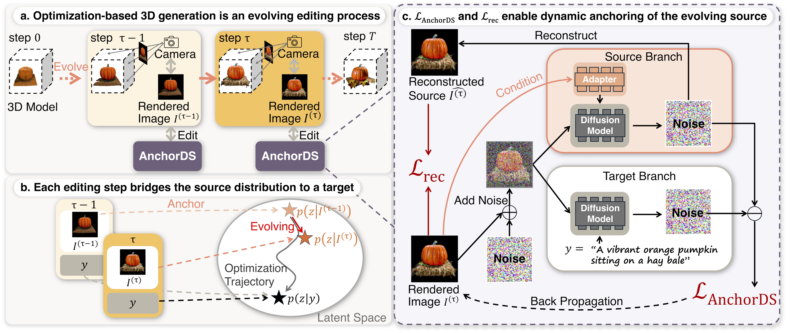

<div align="center">
   <h1 align="center">AnchorDS:   Anchoring Dynamic Sources for Semantically Consistent Text-to-3D Generation
   </h1>

   <p>
      <!-- <a href=https://arxiv.org/abs/2404.04037 target="_blank"></a> -->
      <a href="https://jyzhu.top/AnchorDS_Webpage/" target="_blank"></a>
      <br>
      <a href="https://wakatime.com/badge/user/7974bf3e-99a6-4d26-8e4b-38ca6d5c9c64/project/eb6c8ce3-0ede-47b8-8d9c-54ce3137a549"></a>
      <!-- 
       -->
   </p>
</div>

<p align="center">
  <a href="https://jyzhu.top/" target="_blank">Jiayin Zhu</a><sup>1</sup>,&nbsp;</a>
  <a href="https://www.mu4yang.com/" target="_blank">Linlin Yang</a><sup>2</sup>,&nbsp;</a>
  <a href="https://yl3800.github.io/" target="_blank">Yicong Li</a><sup>1</sup>,</a>
  <a href="https://www.comp.nus.edu.sg/~ayao/" target="_blank">Angela Yao</a><sup>1</sup>;</a>
  <br>
  <a href="https://cvml.comp.nus.edu.sg" target="_blank">Computer Vision & Machine Learning Group</a>, National University of Singapore <sup>1</sup>
  <br/>
  Communication University of China <sup>2</sup>
</p>

<h3 align="center">AAAI 2026</h3>

TL;DR: The core innovation of AnchorDS lies in anchoring dynamic sources during the generation process, which reduces the Janus problem and improves 3D consistency compared to existing SDS variant methods, producing high-quality 3D Gaussian Splatting and NeRF representations from text prompts.

## 🎥 Results Showcase

<div align="center">
<table>
<tr>
<td align="center">
<strong>A red barn in a green field</strong><br>
<video width="200" controls>
<source src="assets/barn.mp4" type="video/mp4">
</video>
</td>
<td align="center">
<strong>A vibrant orange pumpkin sitting on a hay bale</strong><br>
<video width="200" controls>
<source src="assets/pumpkin.mp4" type="video/mp4">
</video>
</td>
</tr>
<tr>
<td align="center">
<strong>A green cactus in a clay pot</strong><br>
<video width="200" controls>
<source src="assets/cactus.mp4" type="video/mp4">
</video>
</td>
<td align="center">
<strong>A gold glittery carnival mask</strong><br>
<video width="200" controls>
<source src="assets/gold_mask.mp4" type="video/mp4">
</video>
</td>
</tr>
</table>
</div>

## 🚀 Get Started

### Installation

Install [3D Gaussian Splatting](https://github.com/graphdeco-inria/gaussian-splatting) and [Shap-E](https://github.com/openai/shap-e#usage) as follows:

```bash
pip install torch==2.0.1+cu117 torchvision==0.15.2+cu117 torchaudio==2.0.2 --index-url https://download.pytorch.org/whl/cu117
pip install ninja
pip install -r requirements.txt

git clone https://github.com/hustvl/GaussianDreamer.git 
cd GaussianDreamer

pip install ./gaussiansplatting/submodules/diff-gaussian-rasterization
pip install ./gaussiansplatting/submodules/simple-knn

git clone https://github.com/openai/shap-e.git
cd shap-e
pip install -e .
```

Download [finetuned Shap-E](https://huggingface.co/datasets/tiange/Cap3D/blob/main/misc/our_finetuned_models/shapE_finetuned_with_330kdata.pth) by Cap3D, and put it in `./load`

### Quickstart

#### AnchorDS with IP-Adapter (Recommended)

```bash
# Gaussian Splatting with IP-Adapter
python launch.py --config configs/gaussiandreamer-sd1.5-anchorDS-ipadapter-finetune.yaml --train --gpu 0 system.prompt_processor.prompt="a bald eagle carved out of wood"

# NeRF with IP-Adapter
python launch.py --config configs/nerf-sd1.5-anchorDS-ipadapter-finetune.yaml --train --gpu 0 system.prompt_processor.prompt="a bald eagle carved out of wood"
```


#### AnchorDS with ControlNet

```bash
# Gaussian Splatting with SD 2.1  
python launch.py --config configs/gaussiandreamer-sd2.1-anchorDS-controlnet-finetune.yaml --train --gpu 0 system.prompt_processor.prompt="a bald eagle carved out of wood"

# NeRF with SD 2.1
python launch.py --config configs/nerf-sd2.1-anchorDS-controlnet-finetune.yaml --train --gpu 0 system.prompt_processor.prompt="a bald eagle carved out of wood"
```

#### Baseline Methods (for comparison)

```bash
# Standard SDS
python launch.py --config configs/gaussiandreamer-sd1.5-sds.yaml --train --gpu 0 system.prompt_processor.prompt="a bald eagle carved out of wood"

# SDS-Bridge
python launch.py --config configs/nerf-sd1.5-sds_bridge.yaml --train --gpu 0 system.prompt_processor.prompt="a bald eagle carved out of wood"
```

### Configuration Options

Our method provides several configuration variants:

- **Backbone Models**: Stable Diffusion 1.5 (`sd1.5`) or 2.1 (`sd2.1`)
- **3D Representations**: Gaussian Splatting (`gaussiandreamer`) or NeRF (`nerf`)
- **Anchoring Methods**: 
  - `anchorDS-controlnet`: Uses ControlNet for anchoring dynamic sources
  - `anchorDS-ipadapter`: Uses IP-Adapter for anchoring dynamic sources
- **Optimization Strategies**:
  - Vanilla AnchorDS
  - `filter`: Optimization with filtering mechanisms
  - `finetune`: Fine-tuned approach


## 📊 Method Overview



## 📄 Citation

If you found this repository/our paper useful, please consider citing:

``` bibtex
@inproceedings{zhu2026AnchorDS,
	title = {AnchorDS: Anchoring Dynamic Sources for Semantically Consistent Text-to-3D Generation},
	author = {Zhu, Jiayin and Yang, Linlin and Li, Yicong and Yao, Angela},
	year = {2026},
	volume = {40},
	booktitle = {Proceedings of the AAAI Conference on Artificial Intelligence}
}
```
